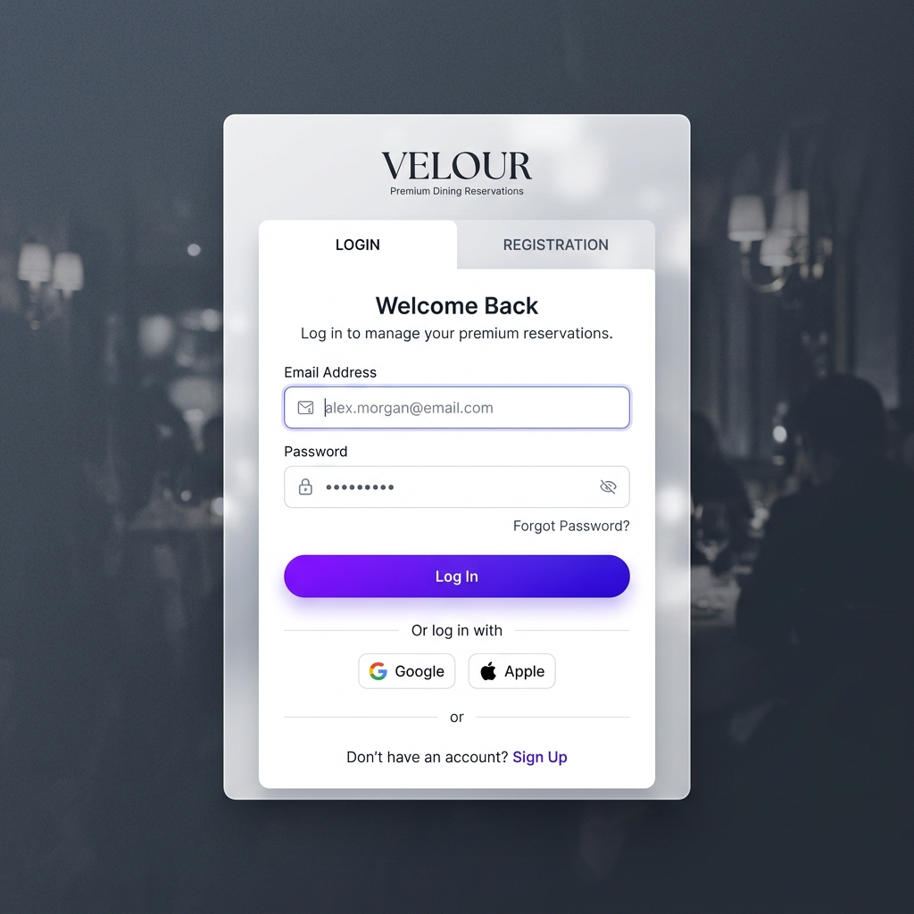
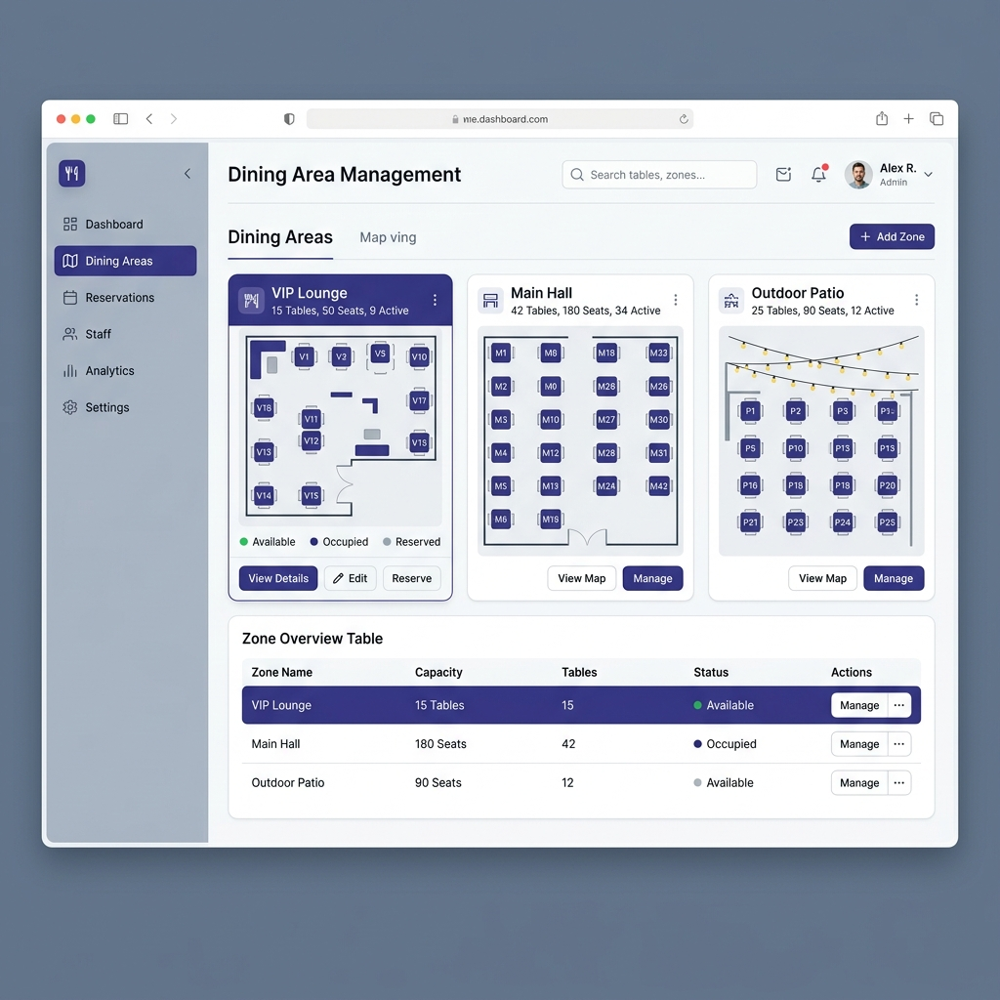
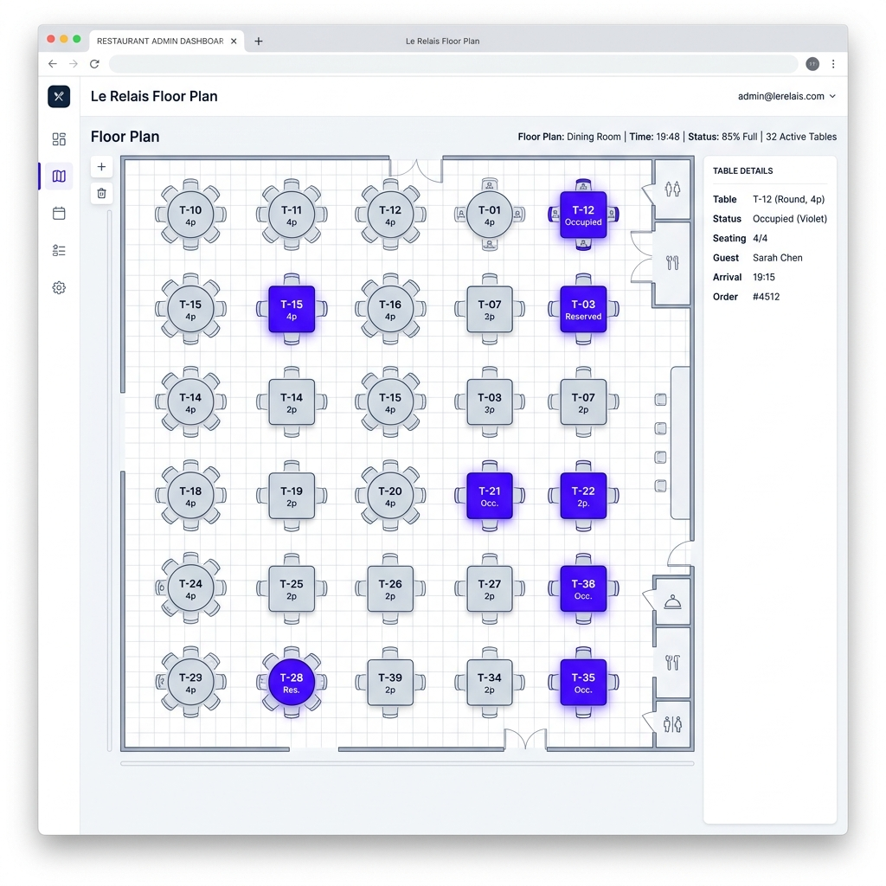
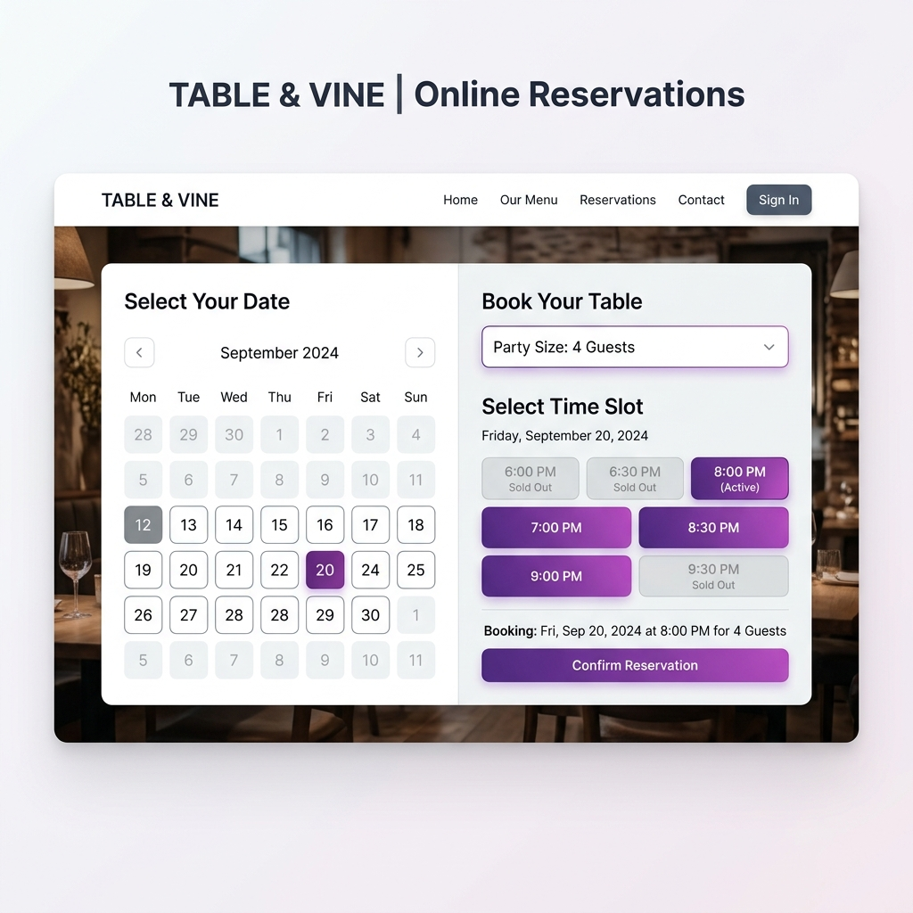
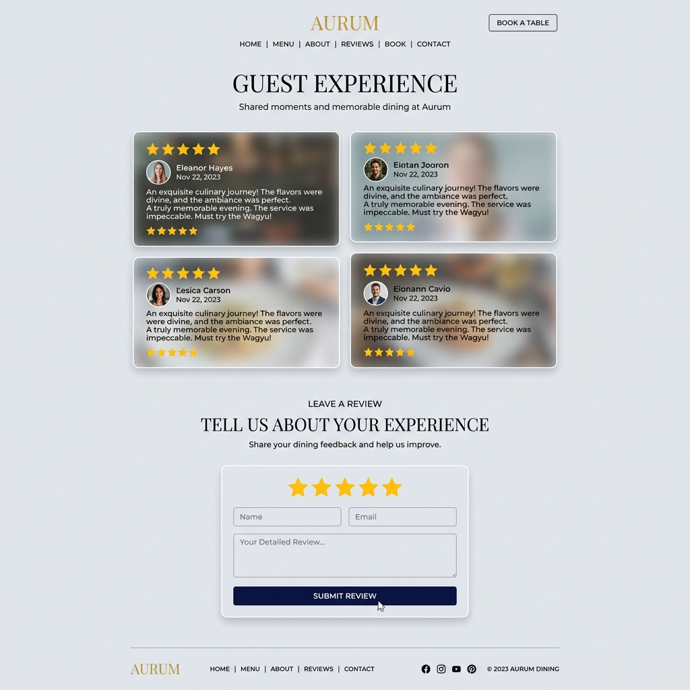
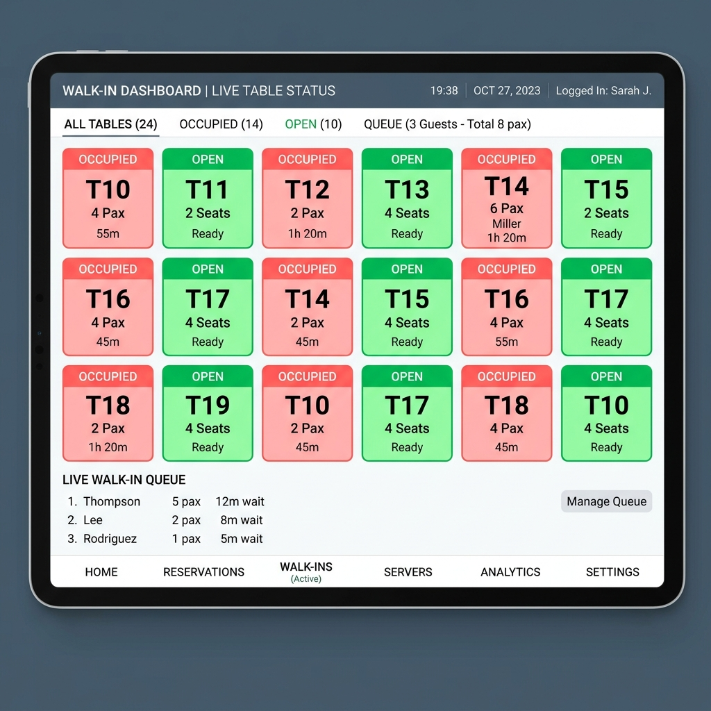

# 🎨 The Project UI Showcase

To ensure our platform feels like a real, premium Restaurant Reservation System, we are establishing a "North Star" visual target. Instead of guessing what our HTML templates should look like, copy the aesthetics shown exactly in these mockups.

## The Style Guide (Tailwind CSS)
All components across the platform must adhere to this exact aesthetic:
* **Backgrounds:** Clean `bg-slate-50` for the page, `bg-white` for data cards.
* **Accents:** Modern `indigo-600` and `purple-600` gradients (`bg-gradient-to-r`).
* **Shadows:** Soft `shadow-xl shadow-slate-200/50` floating cards.
* **Typography:** Clean, sans-serif fonts using `text-slate-900` for headers and `text-slate-500` for descriptions.
* **Inputs:** Gray-bordered text boxes that highlight `focus:border-indigo-600` on click.

---

## The 6 Components

### 1. User Management & Auth (Member 1)
This is what the centralized sign-in portal should look like. Focus on the central glassmorphism layout and sharp buttons.

### 2. Dining Area Management (Member 2)
The Admin view for arranging the restaurant's zones. Note the clean sidebar layout and elegant cards.

### 3. Table Management (Member 3)
The Admin map showing individual Tables placed across the floor plan. 

### 4. Reservation System (Member 4)
The customer-facing booking engine. Extremely clean purple button selectors and a calendar component.

### 5. Review & Complaint Board (Member 5)
The customer-facing portal for viewing and leaving testimonials. Beautiful card stacking and bright gold rating stars.

### 6. FOH Live Walk-In Dashboard (Member 6)
The Admin tool running on an iPad at the front desk. Crucially relies on massive, color-coded table cards (Red = Occupied, Green = Ready) to visualize occupancy instantly.

---

> [!TIP]
> **Use these as inspiration!** You don't have to code every single graphic pixel perfectly. Focus on achieving the same *vibe* and *layout* using basic HTML and Tailwind CSS classes in your templates!
